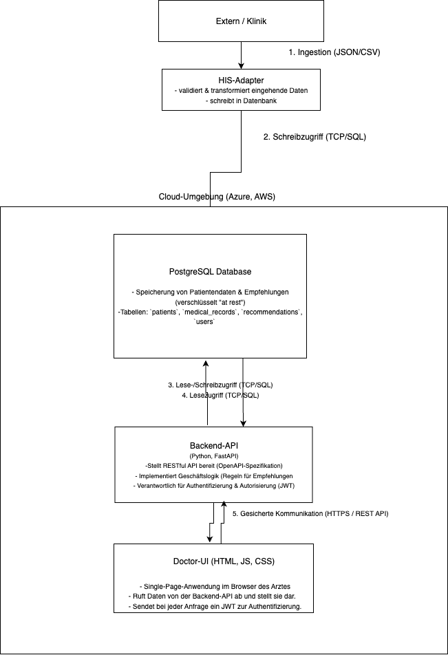

## Architekturübersicht: Medizinisches Empfehlungssystem

Dieses Dokument beschreibt die vorgeschlagene Systemarchitektur für die Aufnahme, Verarbeitung und Darstellung von Patientendaten und Behandlungsempfehlungen.

### Zentrales Architekturdiagramm

Das System ist als **modularer Monolith** konzipiert, um eine schnelle Entwicklung und einfache Wartung zu Beginn zu ermöglichen, während es für zukünftiges Wachstum skalierbar bleibt.

*Hinweis: Dieses Diagramm visualisiert den unten beschriebenen Datenfluss.*

---
### Komponenten & Datenfluss

1.  **Externe Welt / Klinik**: Sendet Patientendaten (JSON/CSV) an das System.
2.  **HIS-Adapter**: Ein dedizierter Service, der eingehende Daten validiert, transformiert und in die Datenbank schreibt.
3.  **PostgreSQL-Datenbank**: Dient als zentrale, relationale Datenbank für alle strukturierten Daten wie Patienteninformationen, medizinische Einträge und Benutzer. Alle Daten werden "at rest" verschlüsselt.
4.  **Backend-API (Python/FastAPI)**: Das Herzstück des Systems. Es stellt eine RESTful API bereit, implementiert die Geschäftslogik (z.B. Empfehlungsregeln) und ist für die Authentifizierung und Autorisierung zuständig.
5.  **Doctor-UI (Frontend)**: Eine Single-Page-Anwendung im Browser des Arztes, die über eine gesicherte HTTPS-Verbindung mit der Backend-API kommuniziert, um Daten darzustellen.

---
### Authentication & Authorization Flow (JWT-basiert)

Der Zugriff wird über JSON Web Tokens (JWT) gesichert:

* **Login**: Ein Arzt authentifiziert sich über einen Login-Endpunkt mit Benutzername und Passwort.
* **Token-Erstellung**: Die API validiert die Daten gegen die `users`-Tabelle, erstellt bei Erfolg ein signiertes JWT (mit User-ID und Rolle) und sendet es an das UI zurück.
* **Gesicherte Anfragen**: Das Doctor-UI fügt das JWT bei jeder nachfolgenden Anfrage in den `Authorization: Bearer <token>` HTTP-Header ein.
* **Token-Validierung**: Die API prüft bei jeder Anfrage die Signatur und Gültigkeit des Tokens, um den Zugriff auf die angeforderten Daten zu autorisieren.

---
### Weitere Architekturentscheidungen

#### Monolith vs. Microservices
**Begründung**: Ein monolithischer Ansatz reduziert zu Beginn die Komplexität in Deployment, Betrieb und Entwicklung erheblich. Durch eine saubere, interne Modularisierung kann das System bei steigenden Anforderungen in Zukunft leicht in einzelne Microservices aufgeteilt werden.

#### Skalierungsansatz
* **Vertikale Skalierung**: Zunächst können die Ressourcen der Cloud-Instanzen (CPU, RAM) für API und Datenbank einfach erhöht werden.
* **Horizontale Skalierung**: Da die API zustandslos (*stateless*) konzipiert ist, können bei höherer Last mehrere Instanzen hinter einem Load Balancer betrieben werden, um die Anfragen zu verteilen.

#### Observability (Logging, Metriken, Tracing)
* **Logging**: Alle Services schreiben strukturierte JSON-Logs, die zentral gesammelt werden (z.B. ELK-Stack).
* **Metriken**: Die API stellt einen `/metrics`-Endpunkt für ein Prometheus-System bereit, um Latenz, Fehlerraten etc. zu überwachen.
* **Tracing**: Durch die Integration von OpenTelemetry kann der Weg einer Anfrage durch das System nachverfolgt werden, um Engpässe zu analysieren.
